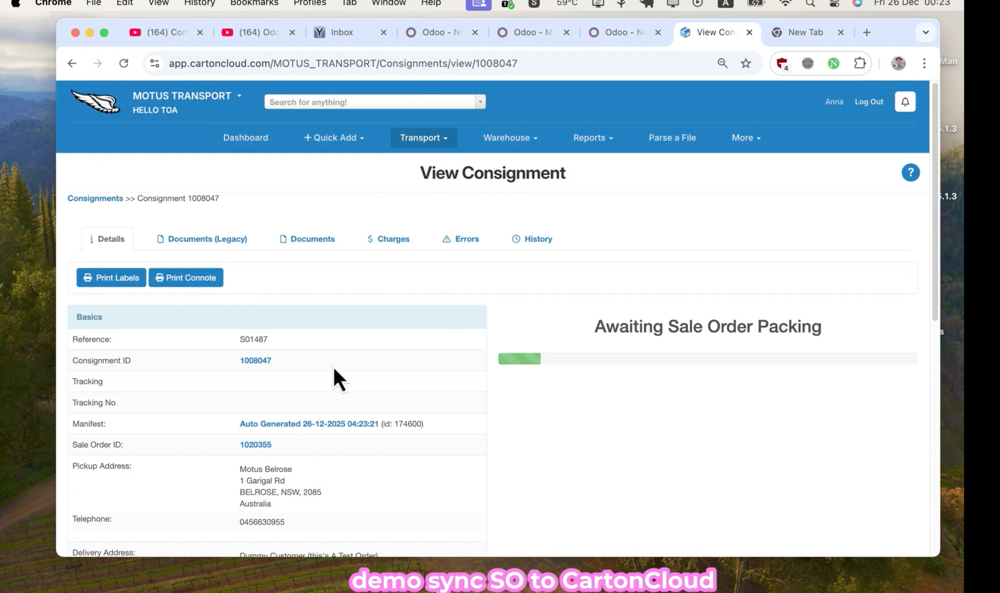
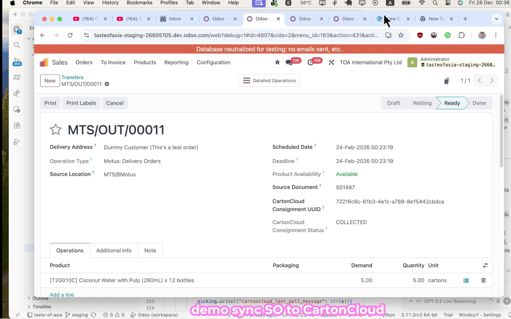

# CartonCloud Connector

CartonCloud is a warehouse and transport management platform used by 3PL providers and logistics teams to manage inventory, inbound orders, outbound orders, and consignments.

This Odoo 17 module integrates CartonCloud warehouse, inventory, inbound, and outbound workflows with Odoo.

## Demo

## Features

- Multi-tenant CartonCloud API configuration with tenant UUID, gateway host, API version, customer UUID, and warehouse UUID.
- Pushes Odoo Sales Orders to CartonCloud as outbound orders.
- Links outbound orders and consignments back to Odoo sale orders and stock pickings.
- Pushes Purchase Orders to CartonCloud as inbound orders.
- Polls inbound/outbound status updates from CartonCloud.
- Syncs CartonCloud stock-on-hand report data into Odoo inventory quants.
- Tracks CartonCloud UUIDs, sync status, last sync time, and polling messages on Odoo records.
- Includes raw queue/raw line models for asynchronous API processing and retry visibility.
- Provides a stock discrepancy adjustment import wizard.
- Includes email templates for order confirmation and payment-related flows.

## Requirements

- Odoo 17.0
- Dependencies: `sale_management`, `account`, `stock`, `mail`, `purchase`
- Valid CartonCloud API client credentials and tenant configuration

## Configuration

Create one or more CartonCloud tenants in Odoo and configure:

- Tenant UUID
- Gateway host
- API version
- Client ID and client secret
- Default customer UUID
- Default warehouse UUID
- Related Odoo company and warehouse

## Technical Notes

The module extends Sales, Purchase, Inventory, Stock Picking, Stock Quant, and Accounting models to keep CartonCloud references and sync state directly on operational records.

## Author

Dan Tran

## License

OPL-1
